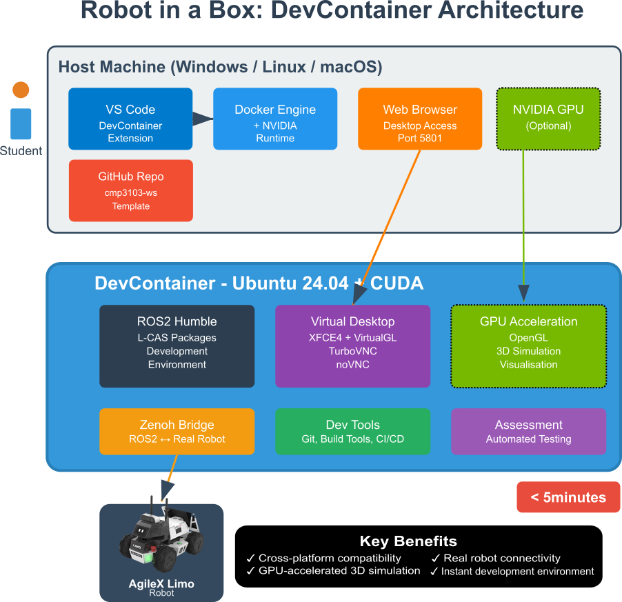

# RosCon25 Workshop Demo: A Robot in a Box

## Teaching Robotics with ROS 2: GPU-Accelerated DevContainers for Education

Welcome to the **RosCon25 workshop demonstration** showcasing a comprehensive GPU-accelerated ROS2 development environment delivered as a DevContainer. This demo is part of the **"Teaching Robotics with ROS 2: Lessons, Platforms, and Perspectives"** workshop at [RosCon UK 2025](https://ros2edu.github.io/).

### 🎯 Workshop Overview

This repository demonstrates how containerized ROS2 environments can transform robotics education by providing students with a fully configured development environment **in under three minutes** from initial setup. The platform runs seamlessly across Windows, Linux, and Mac hosts while maintaining professional development workflows through Visual Studio Code integration.

**Learn more about the workshop:** [https://ros2edu.github.io/](https://ros2edu.github.io/)

### 🏗️ DevContainer Architecture



Our containerized solution features:
- **GPU-accelerated 3D visualization** with VirtualGL and NVIDIA runtime support
- **Virtual desktop with web-based access** eliminating complex local installations
- **Zenoh bridging technology** to connect containerized environments to real-world robots
- **Seamless simulation-to-hardware transition** for comprehensive learning experiences

## 🚀 Quick Start Options

### Option 1: GitHub Codespaces (Fastest)
1. **go to** https://github.com/UoL-SoCS/cmp3103-ws/tree/roscon25
1. **Click the green "Code" button** in this repository
2. **Select "Codespaces" tab**
3. **Click "Create codespace on roscon25"**
4. Wait for the environment to build (~5 minutes)
5. **Jump to [Running the Demo](#-running-the-demo)**

### Option 2: Visual Studio Code with DevContainers


https://github.com/user-attachments/assets/2523747d-7baa-4e1f-89ae-008bd72996c9


#### Prerequisites
- [Visual Studio Code](https://code.visualstudio.com/)
- [Docker Desktop](https://www.docker.com/products/docker-desktop/)
- [Dev Containers extension](https://marketplace.visualstudio.com/items?itemName=ms-vscode-remote.remote-containers)

#### Setup Steps
1. **Clone this repository with the specific branch:**
   ```bash
   git clone -b roscon25 https://github.com/UoL-SoCS/cmp3103-ws.git
   cd cmp3103-ws
   ```

2. **Open in VSCode:**
   ```bash
   code .
   ```

3. **Reopen in Container:**
   - When prompted, click **"Reopen in Container"**
   - Or use Command Palette (`Ctrl+Shift+P`) → "Dev Containers: Reopen in Container"
   - Wait for container build (~5 minutes on first run, downloading the full image with all dependencies)

4. **Verify Container Environment:**
   Look for "Dev Container: ..." in the bottom-left corner of VSCode

## 🤖 Running the Demo

### Step 1: Access the Virtual Desktop

1. **Navigate to the PORTS tab** in VSCode/Codespaces
2. **Click on the "desktop" URL** (usually `localhost:5801` or a tunnel address)
3. **Click "Connect"** when prompted
4. **Enable "Remote Resizing"** for automatic window scaling (see [USAGE.md](USAGE.md) for more details)

### Step 2: Build the Workspace

Open a terminal in VSCode and run:

```bash
# Build the ROS2 workspace
colcon build

# Source the environment
source install/setup.bash
```

### Step 3: Launch the TidyBot Navigation Demo

```bash
# Launch the complete navigation demo
ros2 launch roscon_demo tidybot_navigation.launch.py
```

This command will automatically:
- 🏠 Start the TidyBot simulation environment (Gazebo)
- 🗺️ Launch SLAM Toolbox for real-time mapping
- 🧭 Initialize Nav2 navigation stack for autonomous navigation
- 🎯 Open RViz for visualization and goal setting
- 🔴 Generate 10 red objects in the environment
- 🟢 Generate 10 green objects in the environment

### Step 4: Interact with the Demo (in the virtual desktop)

1. **In RViz (opens automatically):**
   - Use the "2D Goal Pose" tool to set navigation targets
   - Watch the robot autonomously navigate around obstacles
   - Observe real-time SLAM mapping as the robot explores

2. **In Gazebo (virtual desktop):**
   - View the 3D simulation environment
   - Observe the TidyBot robot and scattered objects
   - Monitor the robot's sensor data and behavior

### 🎮 Advanced Demo Features

#### Custom Launch Options
```bash
# Launch without navigation (SLAM only)
ros2 launch roscon_demo tidybot_navigation.launch.py navigation:=false

# Launch without SLAM (use pre-built map)
ros2 launch roscon_demo tidybot_navigation.launch.py slam:=false

# Launch minimal setup (no RViz)
ros2 launch roscon_demo tidybot_navigation.launch.py rviz:=false
```

#### Manual Object Generation
```bash
# Generate additional red objects
ros2 run uol_tidybot generate_objects --ros-args -p red:=true -p n_objects:=5

# Generate additional green objects  
ros2 run uol_tidybot generate_objects --ros-args -p red:=false -p n_objects:=5
```

### ✅ What This Solves
- **Installation complexity:** Zero local ROS2 setup required
- **Platform compatibility:** Works across Windows, Mac, and Linux
- **Hardware requirements:** No dedicated robotics lab needed
- **Assessment scalability:** Consistent environments for all students
- **Remote learning:** Full functionality in distributed education

### 🎓 Learning Outcomes
Students gain hands-on experience with:
- ROS2 launch systems and package management
- SLAM (Simultaneous Localization and Mapping)
- Navigation stack configuration and tuning
- 3D simulation environments (Gazebo)
- Visualization tools (RViz)
- Professional development workflows (VSCode + Git)

## 🔧 For Educators

### Customizing the Demo
- **Add new packages:** Place them in the `src/` directory
- **Modify launch files:** Edit `src/roscon_demo/launch/`
- **Configure dependencies:** Update `src/roscon_demo/package.xml`
- **Adjust parameters:** Modify Nav2 configuration files

### Deployment Strategies
1. **Individual assignments:** Students fork this repository
2. **Classroom exercises:** Use GitHub Codespaces for instant access
3. **Assessment tasks:** Consistent environment ensures fair evaluation
4. **Remote workshops:** Perfect for distributed learning scenarios

## 🌟 Workshop Context

This demo is featured in Prof. Marc Hanheide's lightning talk: **"A robot in a Box: Adventures in GPU-accelerated ROS2 devcontainers for education and assessment"** at the ROS Education Workshop.


**Learn more:** [https://ros2edu.github.io/](https://ros2edu.github.io/)

## Resources:
* Try yourself (e.g. in codespaces): https://github.com/UoL-SoCS/cmp3103-ws/tree/roscon25 
* Our instructions for students to use it: https://github.com/LCAS/teaching/wiki/CMP3103 
* The Lincoln Centre for Autonomous Systems (L-CAS):https://lcas.lincoln.ac.uk/ 


## 📄 License

This project is licensed under the Apache-2.0 License - see the [LICENSE](LICENSE) file for details.
